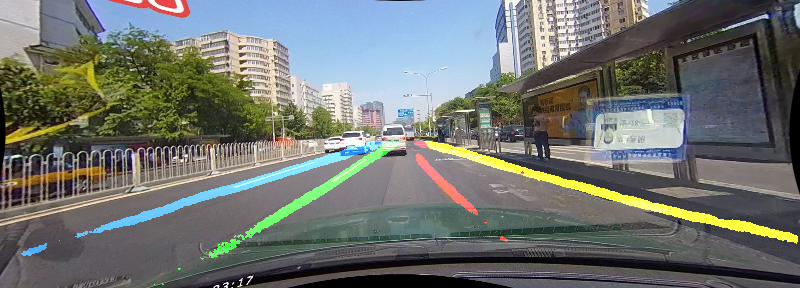
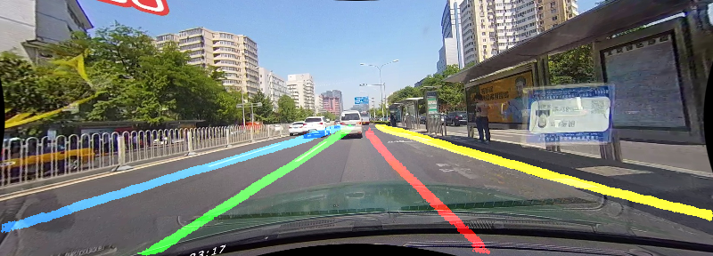
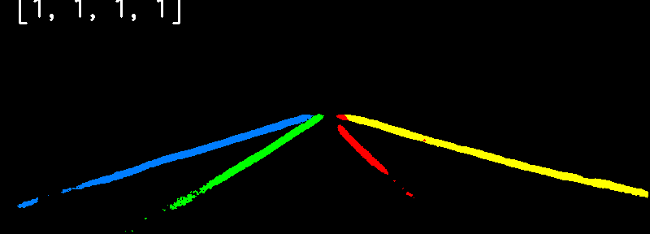
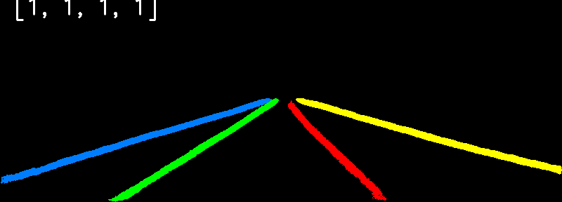

# ENet-SAD Pytorch
 Pytorch implementation of "[Learning Lightweight Lane Detection CNNs by Self Attention Distillation (ICCV 2019)](https://arxiv.org/abs/1908.00821)"


## Demo
#### Video


Demo trained with CULane dataset & tested with \driver_193_90frame\06051123_0635.MP4

`gpu_runtime: 0.016253232955932617 FPS: 61`

`total_runtime: 0.017553091049194336 FPS: 56` on RTX 2080 TI

#### Comparison
| Category | 40k episode (before SAD)                  | 60k episode (after SAD)                  |
| -------- | ----------------------------------------- | ---------------------------------------- |
| Image    |       |       |
| Lane     |  |  |

## Train
### Requirements
* pytorch
* tensorflow (for tensorboard)
* opencv

### Datasets

* [CULane](https://xingangpan.github.io/projects/CULane.html)
  <details><summary>CULane dataset path (click to expand)</summary>
  
  ```
  CULane_path
  ├─ driver_100_30frame
  ├─ driver_161_90frame
  ├─ driver_182_30frame
  ├─ driver_193_90frame
  ├─ driver_23_30frame
  ├─ driver_37_30frame
  ├─ laneseg_label_w16
  ├─ laneseg_label_w16_test
  └─ list
  ```
</details>

* [TuSimple](https://github.com/TuSimple/tusimple-benchmark/issues/3)
  <details><summary>TuSimple dataset path (click to expand)</summary>
  
  ```
  Tusimple_path
  ├─ clips
  ├─ label_data_0313.json
  ├─ label_data_0531.json
  ├─ label_data_0601.json
  └─ test_label.json
  ```
</details>

* [BDD100K](http://bdd-data.berkeley.edu/)
  * Download modified labels and lists generated by author's method ([train](https://drive.google.com/open?id=1wjoOQT6OJlLETz0ZYThBWjSt1Tgzn6_j), [val](https://drive.google.com/open?id=1WaUjdgI4CMXkYFfi8Lz2rHiYYWLU5hav) and [list](https://github.com/cardwing/Codes-for-Lane-Detection/tree/master/ENet-BDD100K-Torch/list)) and put the BDD100K dataset in the desired folder.
  <details><summary>BDD100K dataset path (click to expand)</summary>
  
  ```
  bdd100k_path
  ├─ images
  │  ├─ 10k
  │  └─ 100k
  ├─ list
  │  ├─ test_gt_bdd.txt
  │  ├─ train_gt_bdd.txt
  │  └─ val_gt_bdd.txt
  ├─ train_label
  │  └─ final_train
  └─ val_label
     └─ final_val
  ```
</details>

* [VPGNet](https://github.com/SeokjuLee/VPGNet/issues/50)

You need to change the correct dataset path in `./config.py`
```python
Dataset_Path = dict(
    CULane = "/workspace/CULANE_DATASET",
    Tusimple = "/workspace/TUSIMPLE_DATASET",
    BDD100K = "/workspace/BDD100K_DATASET",
    VPGNet = "/workspace/VPGNet_DATASET"
)
```

### Training
First, change some hyperparameters in `./experiments/*/cfg.json`
```
{
  "model": "enet_sad",               <- "scnn" or "enet_sad"
  "dataset": {
    "dataset_name": "CULane",        <- "CULane" or "Tusimple"
    "batch_size": 12,
    "resize_shape": [800, 288]       <- [800, 288] with CULane, [640, 368] with Tusimple, and [640, 360] with BDD100K
                                        This size is defined in the ENet-SAD paper, any size is fine if it is a multiple of 8.
  },
  ...
}
```

And then, start training with `train.py`
```
python train.py --exp_dir ./experiments/exp1
```

###### Optional
If you write your own code using `ENet-SAD` model, you can init `ENet_SAD` with some parameters.
```python
class ENet_SAD(nn.Module):
    """
    Generate the ENet-SAD model.
    Keyword arguments:
    - input_size (tuple): Size of the input image to segment.
    - encoder_relu (bool, optional): When ``True`` ReLU is used as the
    activation function in the encoder blocks/layers; otherwise, PReLU
    is used. Default: False.
    - decoder_relu (bool, optional): When ``True`` ReLU is used as the
    activation function in the decoder blocks/layers; otherwise, PReLU
    is used. Default: True.
    - sad (bool, optional): When ``True``, SAD is added to model;
    otherwise, SAD is removed. Default: False.
    - weight_share (bool, optional): When ``True``, weights are shared
    with encoder blocks (E2, E3 and E4); otherwise, encoders will each
    learn with their own weights. Default: True.
    """
```

## Performance
Will continue to be updated.

* TuSimple dataset

| Category | ENet-SAD Pytorch | ENet-SAD paper |
| -------- | ---------------- | -------------- |
| Accuracy | 93.93%           | 96.64%         |
| FP       | 0.2279           | 0.0602         |
| FN       | 0.0838           | 0.0205         |

* CULane dataset (F1-measure, FP measure for crossroad)

| Category     | ENet-SAD Pytorch | ENet-SAD paper |
| ------------ | ---------------- | -------------- |
| Normal       |                  | 90.1           |
| Crowded      |                  | 68.8           |
| Night        |                  | 66.0           |
| No line      |                  | 41.6           |
| Shadow       |                  | 65.9           |
| Arrow        |                  | 84.0           |
| Dazzle light |                  | 60.2           |
| Curve        |                  | 65.7           |
| Crossroad    |                  | 1995           |
| Total        |                  | 70.8           | 

* BDD100K

| Category | ENet-SAD Pytorch | ENet-SAD paper |
| -------- | ---------------- | -------------- |
| Accuracy | 37.09%           | 36.56%         |
| IoU      | 15.14            | 16.02          |


## Acknowledgement
This repo is built upon official implementation [ENet-SAD](https://github.com/cardwing/Codes-for-Lane-Detection) and based on [PyTorch-ENet](https://github.com/davidtvs/PyTorch-ENet), [SCNN_Pytorch](https://github.com/harryhan618/SCNN_Pytorch).
